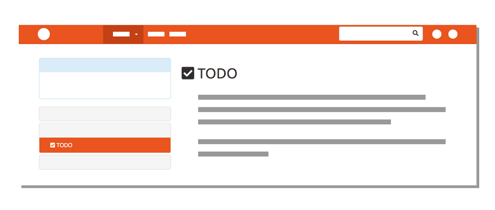

As stated, the majority of your learning materials will be posted of this site. The course is broken up into 4 modules, with 2-4 Topics each (as seen in the “Modules” dropdown menu above).

The left navigation menu further breaks up these topics into sub-topics, meant to offer information in digestible portions.

The last page of each sub-topic is listed under a &nbsp;&nbsp;<i class="fas fa-check-square" aria-hidden="true"></i> <b>TODO</b>&nbsp; heading. This page will provide you with outside materials, review opportunities, or links to assignment requirements. Effectively, it should help you gauge what you should have comprehended from the sub-topic.
