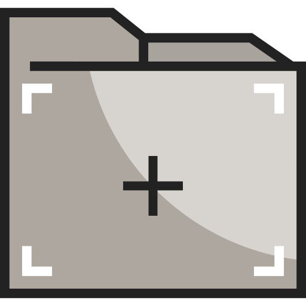

  
  <h2 style="text-align: center;">Files and Directories</h2>

This topic is all about files and directories.  This section describes different files and directories and how they play an essential part in web design and development.

<!--Our course is broken up into 4 modules, at 3-to-4 topics a piece. These topics will help you create the module's project. Your first project (and its topics, beginning with this one) introduces the class and its tools (GitHub), as well as the (in)tangibility of the internet and world wide web.
-->

By the end of this Topic, we hope you:

<ul class="pros-and-cons">
  <li class="icon-pro">Understand different file types and directory structure.</li>
  <li class="icon-pro">Explored the distinction between text editors and word processors, and why we use the former for web development.</li>
  <li class="icon-pro">Create and upload a file</li>
</ul>
