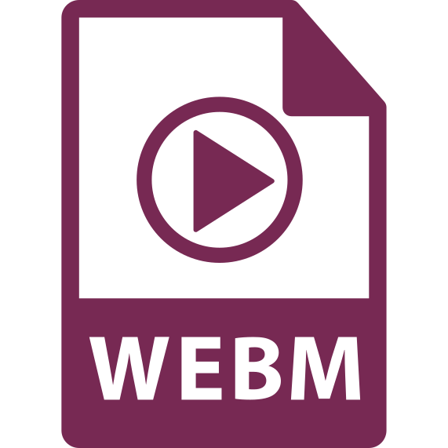

You will come across _many_ types of **media** files on websites. Below are just some common types. However, there are many different kinds available. This list also excludes streaming media, which is used extensively on the web.

  

    
    file.mp3
  

  

    <h3>MPEG-1 Audio Layer 3 (<b>MP3</b>)</h3>
    
MP3 technology has been around for decades, and revolutionized how music was stored and shared during the 1990's. MP3s offer an accessible ratio of playback quality to file size, but it is still subject to patents, meaning users must have MP3-ready software in order to play the file.

    <ul class="pros-and-cons">
      <li class="icon-pro">Small file size.</li>
      <li class="icon-pro">Widely-used; standard practice.</li>
      <li class="icon-con">Proprietary; browsers must pay to support this file type.</li>
    </ul>
  

  

    
    file.ogg
  

  

    <h3>Ogg Vorbis (<b>OGG</b>)</h3>
    
An OGG file is even more compressed than an MP3, but not necessarily at any lower quality. This compression is at a varying bit rate, meaning moments of silence, for example, will have less storage weight than those in an MP3, as MP3s compress at a constant bit rate. The OGG is open-source and free-to-all.

    <ul class="pros-and-cons">
      <li class="icon-pro">Good for internet streaming.</li>
      <li class="icon-pro">In the public domain, free-for-use.</li>
      <li class="icon-con">Limited official development.</li>
      <li class="icon-con">Not as widely recognized as other audio formats.</li>
    </ul>
  

  

    
    file.mp4
  

  

    <h3>MPEG-4 Part 14 (<b>MP4</b>)</h3>
    
Like MP3, MP4 is a multimedia container used to store video and audio, and supports a variety of video coding formats, like H.264. MP4s are usable on most devices, platforms, and browsers.

    <ul class="pros-and-cons">
      <li class="icon-pro">Good video quality.</li>
      <li class="icon-pro">Widely-used; standard practice.</li>
      <li class="icon-con">Online MP4 files requires pre-buffering.</li>
      <li class="icon-con">Proprietary; browsers must pay to support this file type.</li>
    </ul>
  

  

    
    file.webm
  

  

    <h3>Web Media (<b>WebM</b>)</h3>
    
A relatively new format (2010), WebM is a container created by Google as a standard supported format in HTML5. It has a lower quality and smaller files sizes than MP4, but it results in quicker access and download speeds. Unlike MP4, WebM is open-source and free-to-all.

    <ul class="pros-and-cons">
      <li class="icon-pro">Designed for internet streaming.</li>
      <li class="icon-pro">Open-source, free-for-use.</li>
      <li class="icon-con">Poor compatibility with mobile devices and players.</li>
      <li class="icon-con">Not widely supported.</li>
    </ul>
  

