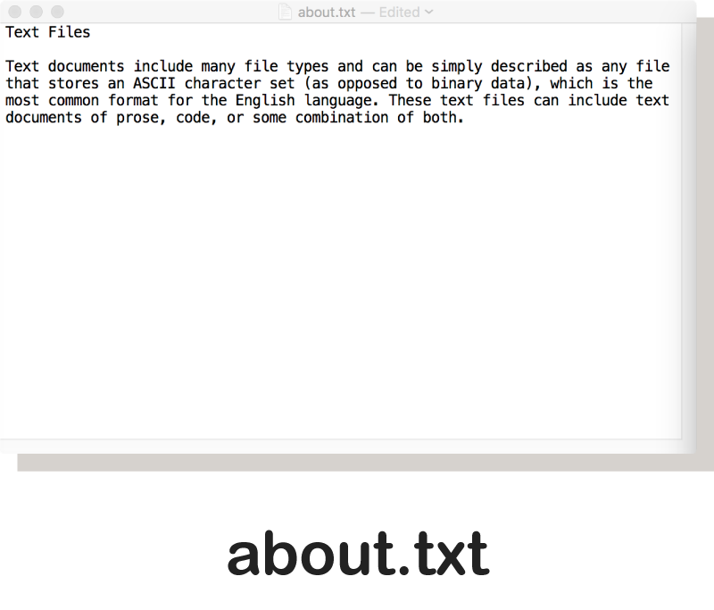
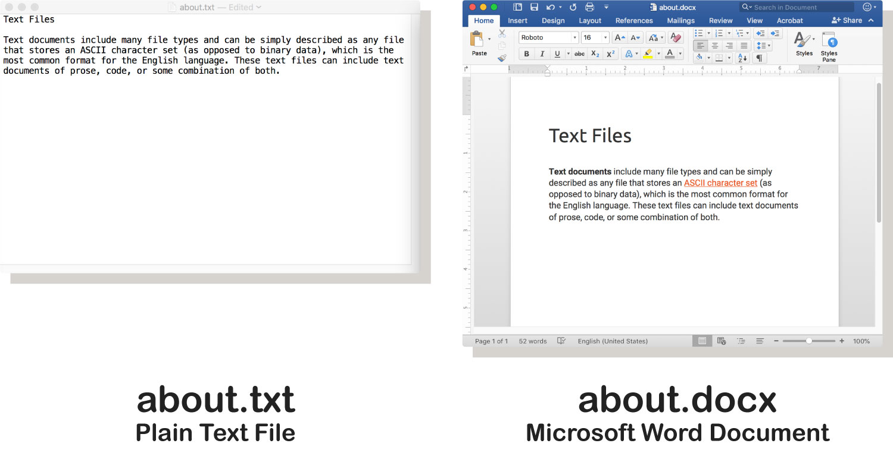
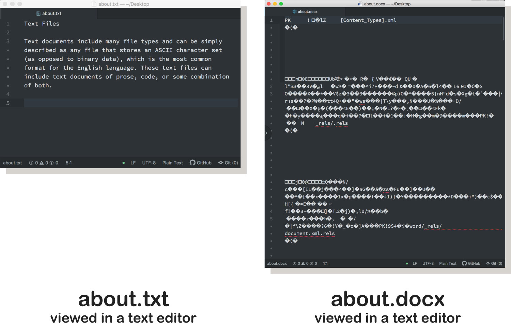

As you just read in “<a href="../web-files-text">Text Documents</a>”, said **text documents** are files that store an [ASCII character set](https://en.wikipedia.org/wiki/ASCII) (as opposed to binary data), which is the most common format for the English language.

## Creating plain text files
Text files can be created and edited using a **“text editor,”** which is any application for editing ASCII text documents. <a href="https://atom.io/" target="_blank">Atom</a>, <a href="https://code.visualstudio.com/download">VS Code</a>, <a href="https://www.sublimetext.com/" target="_blank">Sublime Text</a>, and <a href="http://brackets.io/" target="_blank">Brackets</a> are popular options among web developers.

The default application on Mac and Windows are the following:

- macOS - _textEdit.app_
- Windows - _Notepad.exe_

## What types of files are text documents?
The simplest and most common text document is a "text file", which will bare the `.txt` extension. This generic document type contains only ASCII characters. These are the familiar characters used when writing and reading (A-Z, a-z, 0-9) and special characters (such as #, %, !, etc.). These files also include carriage returns (new line), tabs, spaces, and an end-of-file (EOF) designation that lets a program know where the file finishes. This last group contains characters that are there but not displayed in basic text editors.

## “Well, I have Microsoft Word, so...”

There is a temptation to equate Microsoft Word Document files (`.doc` or `.docx`) to text files. However, these are containers of many smaller files that are ZIP-compressed together into the `.docx` file. This complex file stores images, objects, text, and formatting instructions in a single file, which can then be easily saved, shared, or sent between users of the Microsoft productivity applications.

The downside to this format is that you cannot open this file in a basic text editor to change it. The image below shows a Microsoft Word Document (`.docx`) opened in the Atom text editor. As you can see, this file does not present itself in a way that offers you much understanding of its contents.

## What are other types of plain text-based files?

Well, as you might guess, most computer languages are saved as plain text or ASCII files. However, they often have different extensions. These extensions provide information to the computer and the user as to ‘how’ the file may be used or _compiled_.

In this class, we will be using the following text file types;

- Markdown; `.md`
- HyperText Markup Language (HTML); `.html`
- Cascading Style Sheet (CSS); `.css`

We'll look at the first type; Markdown or `.md` files using a text editor.
