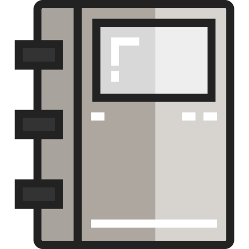

  
  <h2 style="text-align: center;">The Internet</h2>

Last week, we spent time with an overview of files and directories. This week will build on these ideas by further expanding our development environment with more of the tools that you'll use throughout your time here as well as what the Internet is and is not.

By the end of this week, we hope you:
<ul class="pros-and-cons">
  <li class="icon-pro">Understand the importance how information flows on the world wide web.</li>
  <li class="icon-pro">Understand URLs.</li>
  <li class="icon-pro">ReadMe files and basic Markdown elements</li>
  <li class="icon-pro">Build a simple file</li>
</ul>
