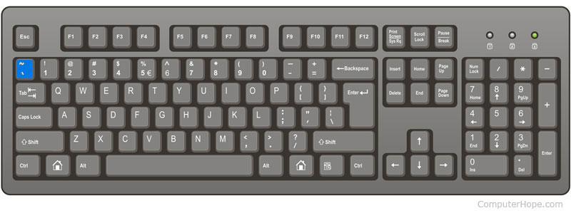

<div class="divider-heading"></div>


You may wish to ask for help with code that isn't working. To add **inline code** within a sentence using Markdown (like `width=20`), wrap it in single back-tick characters.

Large amounts of code should go in **code blocks**. In Markdown, code blocks are created by “fencing” code with three back-ticks above and below, and delineating its language on the top row.

On most American keyboards, the back-tick is the leftmost key on number line, below esc.



<div class="code-heading">
  <span class="md">Markdown</span>
</div>
<div class="language-markdown highlighter-rouge"><div class="highlight"><pre class="no-highlight"><code>
Inline code is made is made with single back-ticks, like `width=20`. Code blocks are created by “fencing” code with three back-ticks above and below, and delineating its language on the top row.

```html
width="20"
height="30"
```
</code></pre></div></div>

<div class="code-heading">
  <span class="preview">Preview</span>
</div>
<div class="preview">
<p>Inline code is made is made with single back-ticks, like <code>width=20</code>. Code blocks are created by “fencing” code with three back-ticks above and below, and delineating its language on the top row.</p>

<div class="language-markdown highlighter-rouge"><div class="highlight"><pre class="no-highlight" style="margin: .5em auto; padding-bottom: 4rem;"><code>
<span class="na">width=</span><span class="s">"20"</span>
<span class="na">height=</span><span class="s">"30"</span>
</code></pre></div></div>
</div>

<br>

See <a href="https://github.com/adam-p/markdown-here/wiki/Markdown-Cheatsheet#code" target="_blank">more on code highlighting</a>.
