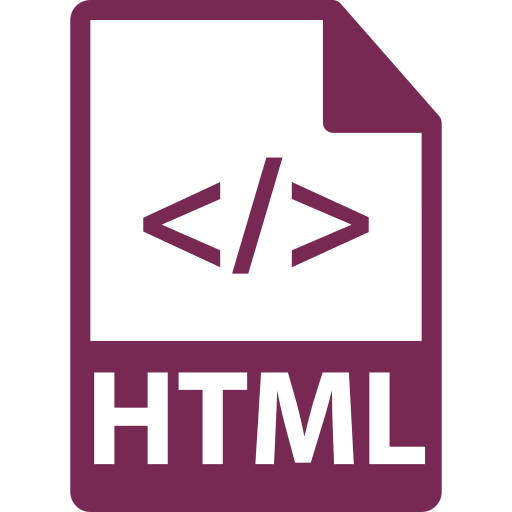

Everything you see on a browser is a combination of _markup_ (text), _style_ (design), and _scripts_ (interactivity). The markup language dictates the page's architecture, with a focus on its text content (although not exclusively).

  

    
    page.html
  

  

    <h3>Hypertext Markup Language (<b>HTML</b> or <b>HTM</b>)</h3>
    
The first and most well-known of internet languages, HTML functions as the foundation and structure of a page's content. After it is set, other aspects can be embedded or attached to that page, like stylesheets or scripts.

    <ul class="pros-and-cons">
      <li class="icon-pro">Most widely-used web language.</li>
      <li class="icon-pro">Standardized element and tagging system.</li>
      <li class="icon-pro">Is used to render content and page structure.</li>
      <li class="icon-con">Consistent version changes and updates require extended education.</li>
      <li class="icon-con">Quality of HTML usage is varied, meaning sites may not always work cross-browser or cross-device.</li>
    </ul>
  

  

    
    page.xml
  

  

    <h3>Extensible Markup Language (<b>XML</b>)</h3>
    
A compliment to HTML, XML <i>describes</i> document nodes, whereas HTML <i>displays</i> document nodes. Its major usage today is in <a href="https://www.youtube.com/watch?v=RDo3hBL1rfA" target="_blank">the technologies like those utilized by Gmail</a> that allow specific elements to update without having to refresh the entire page.

    <ul class="pros-and-cons">
      <li class="icon-pro">Stored in plain-text format, which simplifies data sharing.</li>
      <li class="icon-pro">Eases data transport and availability.</li>
      <li class="icon-pro">Allows for upgrading without losing data.</li>
      <li class="icon-con">Does not “do” or render anything, just provides tagged information.</li>
      <li class="icon-con">No pre-defined tags; author must define and structure individually.</li>
    </ul>
  

  

    
    page.xhtml
  

  

    <h3>Extensible Hypertext Markup Language (<b>XHTML</b>)</h3>
    
Essentially a bridge between HTML and XML, XHTML combines the best of both in an attempt to correct some lenient behaviors of HTML; in particular, those that cause problems on mobile devices. While computer browsers can correct some “bad” HTML, smaller devices often lack the resources to perform these operations.

    <ul class="pros-and-cons">
      <li class="icon-pro">Almost identical to HTML.</li>
      <li class="icon-pro">Usage ensures that documents are marked-up correctly.</li>
      <li class="icon-pro">Strict code requirements make it less vulnerable to future changes - longer to write, but easier to maintain.</li>
      <li class="icon-con">XHTML documents must meet more rigorous standards that HTML to function properly.</li>
      <li class="icon-con">Because it is more precise, it is more time-consuming to write.</li>
    </ul>
  

