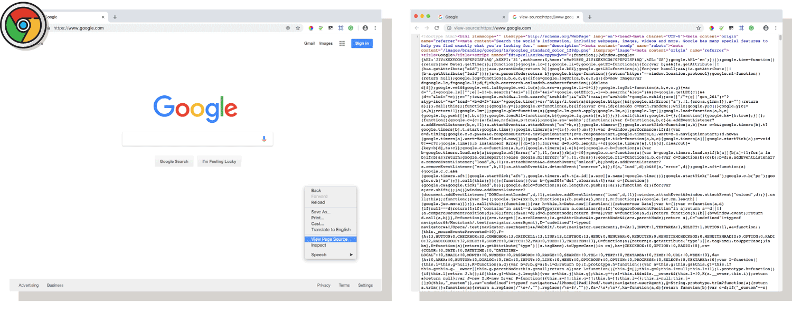
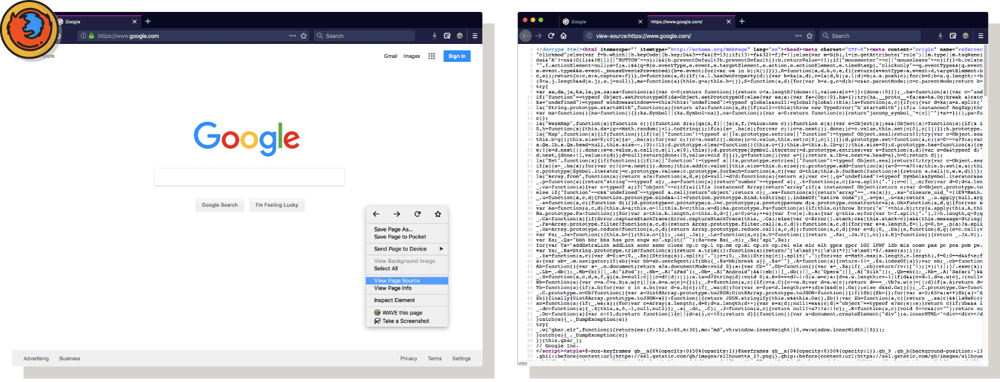
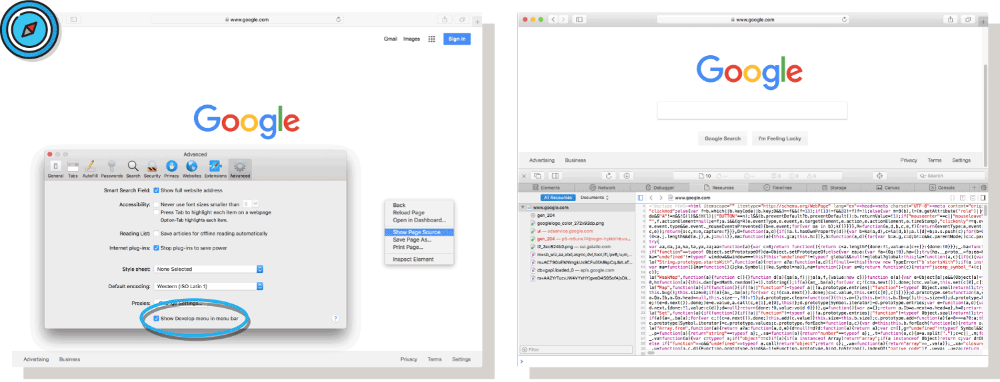

A great way to learn website development is to see it in action. All internet browsers allow viewing of a site's core code allowing visitors to explore how other developers make their sites.

One invaluable way of doing this is “**view-source**,” or viewing the site's source code. This way of snooping shows the code _exactly_ as it was delivered from the server to the browser, which has its pros and cons:

<ul class="pros-and-cons">
  <li class="icon-pro">Quick and easy view; legible and exact.</li>
  <li class="icon-pro">May “catch” invalid code, and show what needs correcting.</li>
  <li class="icon-con">Does not show how the DOM <i>actually</i> built the page.</li>
</ul>

## Chrome
In <a href="https://www.google.com/chrome/" target="_blank">Chrome</a>:
1. Right click in an empty area of the page.
2. Select "View Source."

## Firefox
In <a href="https://www.mozilla.org/en-US/firefox/new/" target="_blank">Firefox</a>:
1. Right click in an empty area of the page.
2. Select "View Source."

## Safari
To inspect code in Safari, you first turn on the developer tools:
1. Open preferences.
2. Go to the advanced tab.
3. Select "Show Develop menu in the menu bar."
4. Right-click in an empty area of the page.
5. Select "View Source."

## Internet Explorer, Edge
To inspect code in Edge:
1. Right-click in an empty area of the page.
2. Select "View Source."
