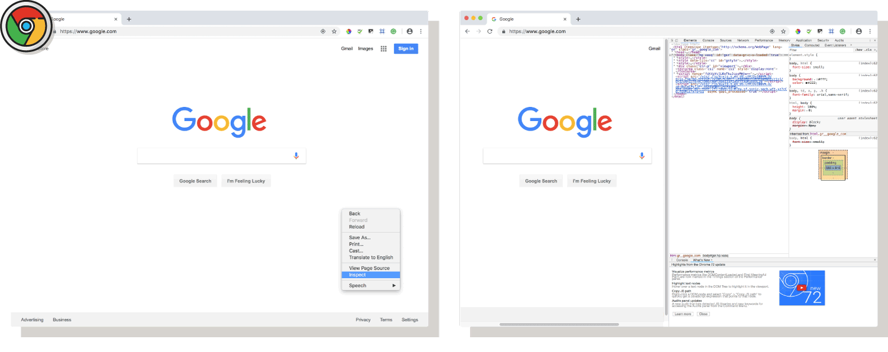
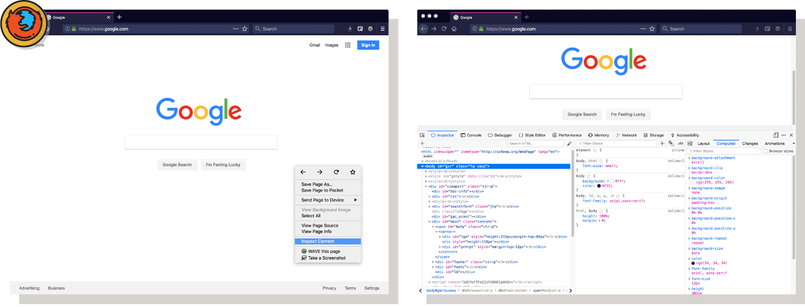
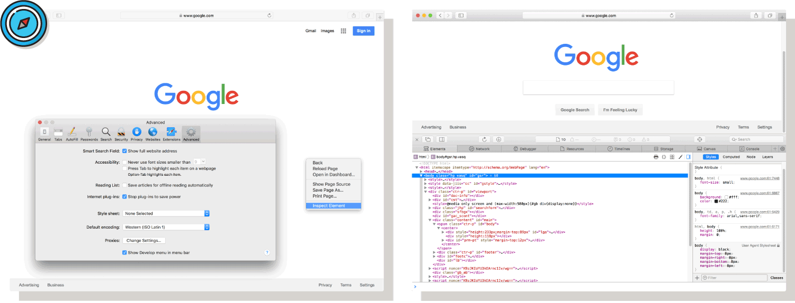

There is too much information for any one person to know right away in development and coding. Another tool you can use when getting started is “**inspect element**,” or inspecting the site's current DOM tree state. This way of snooping shows the code _normalized_ by the browser, which has its pros and cons:

<ul class="pros-and-cons">
  <li class="icon-pro">Complete view; shows everything dictating the page.</li>
  <li class="icon-pro">Shows code in a “corrected state,” adding missing tags, or fixing invalid code.</li>
  <li class="icon-con">Can be complex, and requires higher-level understanding of web languages to navigate.</li>
</ul>

## Chrome
In <a href="https://www.google.com/chrome/" target="_blank">Chrome</a>:
1. Right click in an empty area of the page.
2. Select “Inspect.”

## Firefox
In <a href="https://www.mozilla.org/en-US/firefox/new/" target="_blank">Firefox</a>:
1. Right click in an empty area of the page.
2. Select “Inspect Element.”

## Safari
To inspect code in Safari, you first need to make it so you can see the developer tools:
1. Open preferences.
2. Go to the advanced tab.
3. Select “Show Develop menu in menu bar.”
4. Right click in an empty area of the page.
5. Select “Inspect Element.”
There is too much information for any one person to know right away in development and coding. Another tool you can use when getting started is “**inspect element**,” or inspecting the site's current DOM tree state. This way of snooping shows the code _normalized_ by the browser, which has its pros and cons:

<ul class="pros-and-cons">
  <li class="icon-pro">Complete view; shows everything dictating the page.</li>
  <li class="icon-pro">Shows code in a “corrected state,” adding missing tags, or fixing invalid code.</li>
  <li class="icon-con">Can be complex, and requires higher-level understanding of web languages to navigate.</li>
</ul>

## Chrome
In <a href="https://www.google.com/chrome/" target="_blank">Chrome</a>:
1. Right click in an empty area of the page.
2. Select “Inspect.”

## Firefox
In <a href="https://www.mozilla.org/en-US/firefox/new/" target="_blank">Firefox</a>:
1. Right click in an empty area of the page.
2. Select “Inspect Element.”

## Safari
To inspect code in Safari, you first need to turn on the developer tools:
1. Open preferences.
2. Go to the advanced tab.
3. Select “Show Develop menu in the menu bar.”
4. Right-click in an empty area of the page.
5. Select “Inspect Element.”

## Internet Explorer, Edge
To inspect code in Edge:
1. Select the text, images, or links in the browser
2. Right-click and select Inspect.
3. The developer tools should appear, showing the HTML of those elements

## Internet Explorer, Edge
It is very difficult to develop for and with these products. It is recommended you use one of the browsers above for the duration of the course.
