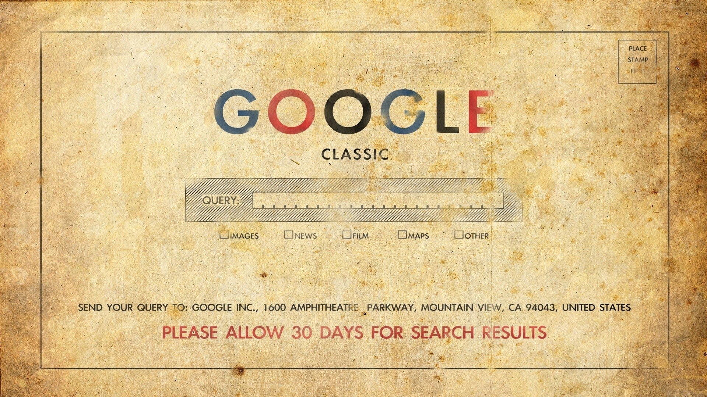

Yet another resource is **internet archives.** Internet Archives may not be the best resource for learning how to code a website, but it does allow you to get a sense of how a company may have viewed their brand over time, how the web used to look or retrieve information from the past that is no longer live.

## The Wayback Machine
<a href="https://archive.org/web/" target="_blank">The Wayback Machine</a> allows you to see what certain websites looked like at different points in history.

<iframe src="https://umontanamediaarts.com/MART341/wp-admin/admin-ajax.php?action=h5p_embed&id=20" width="877" height="761" frameborder="0" allowfullscreen="allowfullscreen"></iframe>
<a href="https://umontanamediaarts.com/MART341/wp-admin/admin-ajax.php?action=h5p_embed&id=20" class="btn btn-default btn-xs" target="_blank">View Larger</a>

## Examples
Here are some sites that had _obvious_ changes in the new century!

 

  

    

      

        <a href="https://web.archive.org/web/19971023010656/http://www3.whitehouse.gov:80/" target="_blank" class="list-group-item">
          
          <h4 class="list-group-item-heading">The White House from Oct. 23, 1997</h4>
          

          
<i class="fas fa-link" aria-hidden="true"></i> External Site

        </a>
      

    

  

  

    

      

        <a href="https://web.archive.org/web/19961121230155/http://nytimes.com/" target="_blank" class="list-group-item">
          
          <h4 class="list-group-item-heading">The New York Times from Nov. 21, 1996</h4>
          

          
<i class="fas fa-link" aria-hidden="true"></i> External Site

        </a>
      

    

  

  

    

      

        <a href="http://web.archive.org/web/19961222031059/http://www.mtv.com/" target="_blank" class="list-group-item">
          
          <h4 class="list-group-item-heading">MTV from Dec. 22, 1996</h4>
          

          
<i class="fas fa-link" aria-hidden="true"></i> External Site

        </a>
      

    

  

