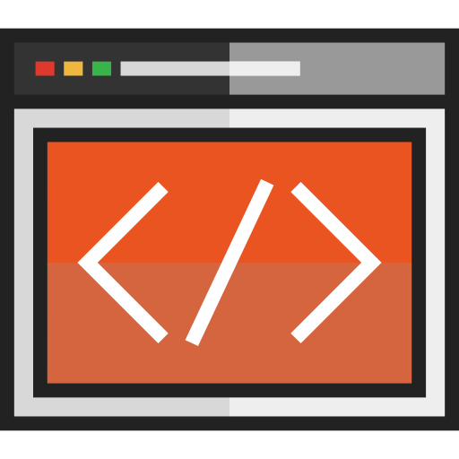

  
  <h2 style="text-align: center;">Additional HTML Elements</h2>

This topic, we'll spend our time almost exclusively learning about additional HTML elements.

Starting with a quick review, we'll move into structural markup elements like ordered and unordered lists. Lists are used continuously in communicating information, and HTML has very logical ways for working with lists.

We'll explore several semantic markup elements used to add or change the meaning of text and prose. We'll also look at how to use links for other websites, as well as e-mail.

Also, you are welcome to utilize the textbook, <a href="http://www.htmlandcssbook.com/" target="_blank"><i>HTML & CSS</i></a>.

By the end of this Topic, we hope you:
<ul class="pros-and-cons">
  <li class="icon-pro">Are comfortable with structuring HTML documents, as well as many types of semantic markup.</li>
  <li class="icon-pro">Have a firm grasp of linking, both internally and externally.</li>
  <li class="icon-pro">Understanding ordered and unordered lists.</li>
</ul>
