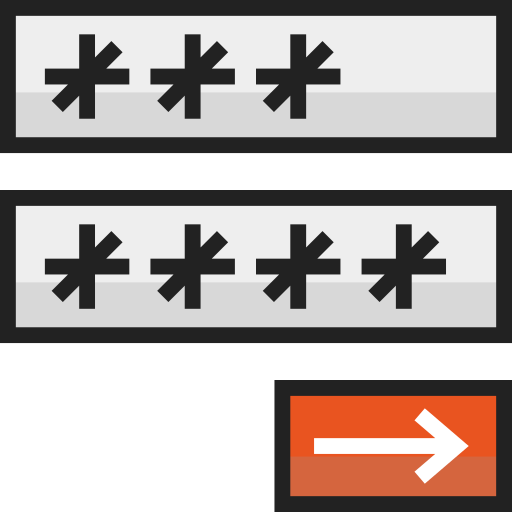

  
  <h2 style="text-align: center;">HTML Images, Tables, and Forms</h2>

In this topic, we will look further into HTML images, you'll be introduced to some additional elements such as images, tables, and one of the foundations of web development - forms.

As we saw earlier, we can add images in by using the `` tag along with the `src=` attribute, but there are more attributes that we should consider particularly when it comes to accessibility.

Although tables may appear antiquated by today's visual standards, HTML tables are still used quite often when presenting data in a structured format. 

Forms allow us to collect data from visitors where users enter data which is then sent to a server for processing. One of the most common forms you encounter daily is the _user login_.

By the end of this Topic, you will understand:
<ul class="pros-and-cons">
<li class="icon-pro">Some of the additional attributes of images</li>
  <li class="icon-pro">How to combine elements to better describe, present, and gather information</li>
  <li class="icon-pro">Experiment with form elements, and explore how data is presented and collected on websites.</li>
</ul>
