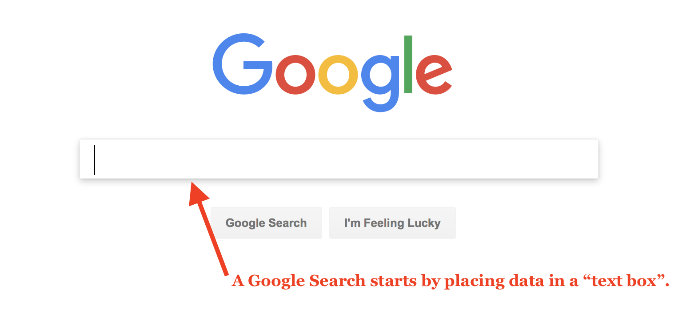

Forms and form elements are used by web developers to collect data & information from users on websites. This can include:

- drop down boxes (multiple choices)
- text entry (usernames, real names, phone numbers, e-mails, etc)
- radio checkmarks/buttons (select all-that-apply)
- password input (hidden text)
- buttons (used for submitting information and navigating to new pages)
- file uploads

We will not use forms very much this semester, as they inherently require a more robust language to handle their collection and transmission. This is one of the roles of **JavaScript**, which will be discussed more in the second Web course ("MART 441 Web Technologies"). However, there are services which will allow us to create forms for websites that can do the front-end and back-end lifting/handling of the data.

The most common example of a form in use is a searchbox, such as [Google](https://google.com) or [YouTube](https://youtube.com).

