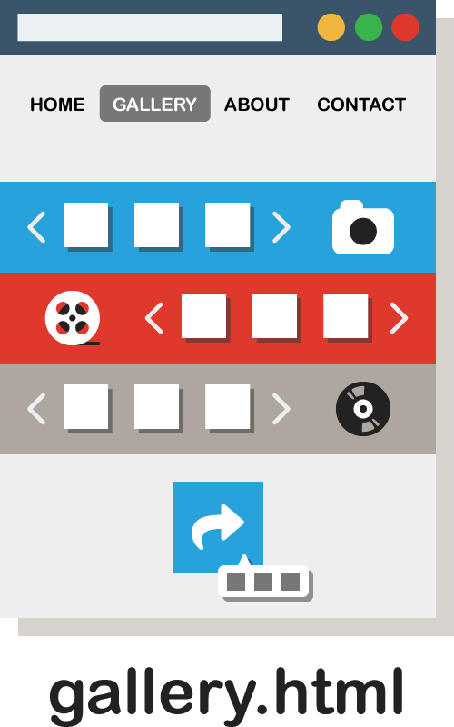

Up to this point, we've added HTML elements to pages singularly, in that they really had no defined groupings. But most pages are built on “blocks” of content placed in relation to each other.

Consider an HTML file "**gallery.html**," that might be on your website:

The gallery page has 4 defined areas that display different content based on their type:
1. image
2. video
3. audio
4. social media sharing button for visitors to use

Within each of these areas there is a section for files, a slider (or scrollable gallery) to present those files interactively, and a decorative illustration.

These sections, or _divisions_, help us control how content looks en masse, rather than element-by-element. This will become more apparent as we go on.

To describe the examples you've been seeing, elements on these pages work much like building “blocks” - separate bricks that come together to create the structure of the page.

These elements are primarily given two distinctions; **block-level elements** take up the full-width of the page, while **inline elements** do not cause line breaks and can neighbor each other naturally.

<h2 id="block-level">Block-Level Elements</h2>

Block elements appear on their own block on a new line. Each of these (unless told otherwise through styling) appears on a new line in HTML pages. Some block elements are:

- Headings `<h1>`-`<h6>`
- Paragraphs `
`
- Lists `<ol>`, `<ul>`
- Horizontal rules `
`

In the example above, a new type of block-level element was used (the `
`) to section-off a row for each media gallery, which altogether fills the page edge-to-edge.

<h2 id="inline">Inline Elements</h2>

Inline elements are not automatically given additional area on the page outside of their contents. Essentially, these means inline elements can be adjacent, rather than atop or below each other. Some inline elements are:

- Images ``
- Semantic elements `<em>`, `<b>`, etc.
- Links `<a>`

In the example above, a new type of inline element was used (the ``) to create the slider. Since `` is also an inline element, the illustration can sit on the same block.
