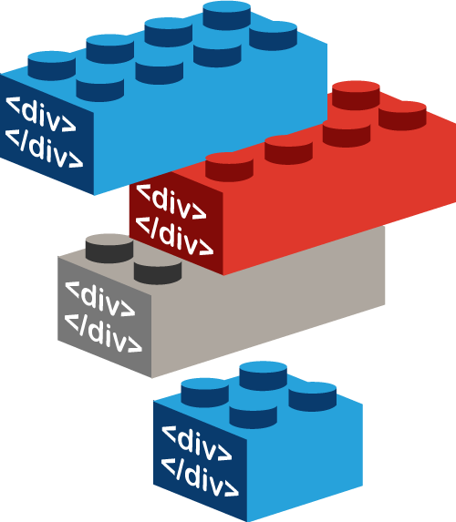

<div class="divider-heading"></div>

Up till this point, all elements that we have looked at have had specific structural or semantic purposes (i.e. defining a paragraph, heading, emphasized text, or including images). There are, however, elements that provide structure without necessarily implying styling or content.

<div class="container-row">
  

  <p>The <code>&lt;div&gt;...&lt;/div&gt;</code> element offers developers a <b>block-level element</b> to group other elements together.</p>

  <p>Divs can be <b>singular or nested</b> within each other. This element is heavily used by developers to increase structural clarity and identify element groups. This in turn, increases readability, which is always desired.</p>
</div>


<div class="code-heading">
  <span class="html">HTML</span>
</div>
```html
<div id="one">
  <!-- Content -->
</div>

<div id="two">
  <!-- Different Content -->
</div>
```


This element also serves as an easy way to wrap content to style via CSS. _By itself, the sole styling implied by the_ `div` _element is that it will start on a new line_
