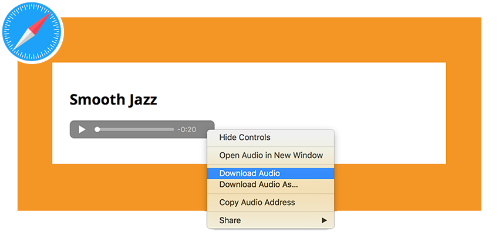
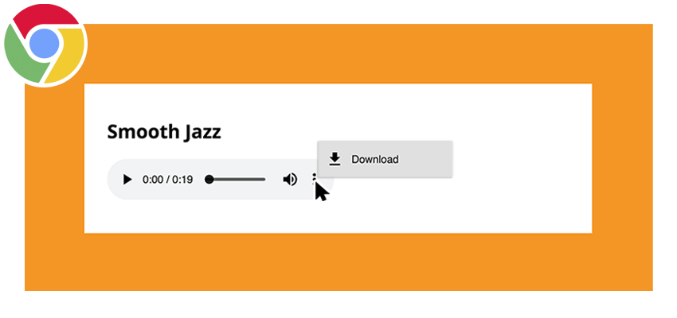

Important All media you use on your sites should be your own or in "fair public use," usually under <a href="https://creativecommons.org/" target="_new">Creative Commons</a> (CC) public licence. **You should always credit the author when asked to do so.**

Important Test your pages on multiple computers and browsers to make sure the embedded media works.

## Common Downloadable Audio Sources

- <a href="https://archive.org/details/audio" target="_new">The Audio Archive</a>
- <a href="https://www.youtube.com/audiolibrary/music" target="_new">YouTube Audio Library</a>
- <a href="https://freesound.org/" target="_new">Freesound</a>
- <a href="https://incompetech.com/music/royalty-free/collections.php" target="_new">Incompetech.com</a>

## How-To:

The Audio Archive, for example, is a great source of royalty-free and creative commons audio works, usually offered in MP3 format.
Here's an example from the <a href="https://archive.org/details/SVS-3044" target="_new">Apollo 11 landing</a> using Chrome:

  
<iframe src="https://archive.org/embed/SVS-3044" style="position:absolute;top:0;left:0;width:100%;height:100%;" frameborder="0" webkitallowfullscreen mozallowfullscreen allowfullscreen></iframe>

  

One of the potential issues of using the `<audio>` element in particular is that it allows end-users to easily download the audio file. For example, in Safari, this can be done by right-clicking the audio player and selecting “Download Audio.” Chrome actually provides a download button with the audio player.

This ability is something to weigh when considering _content protection_, discussed at the end of this section.
