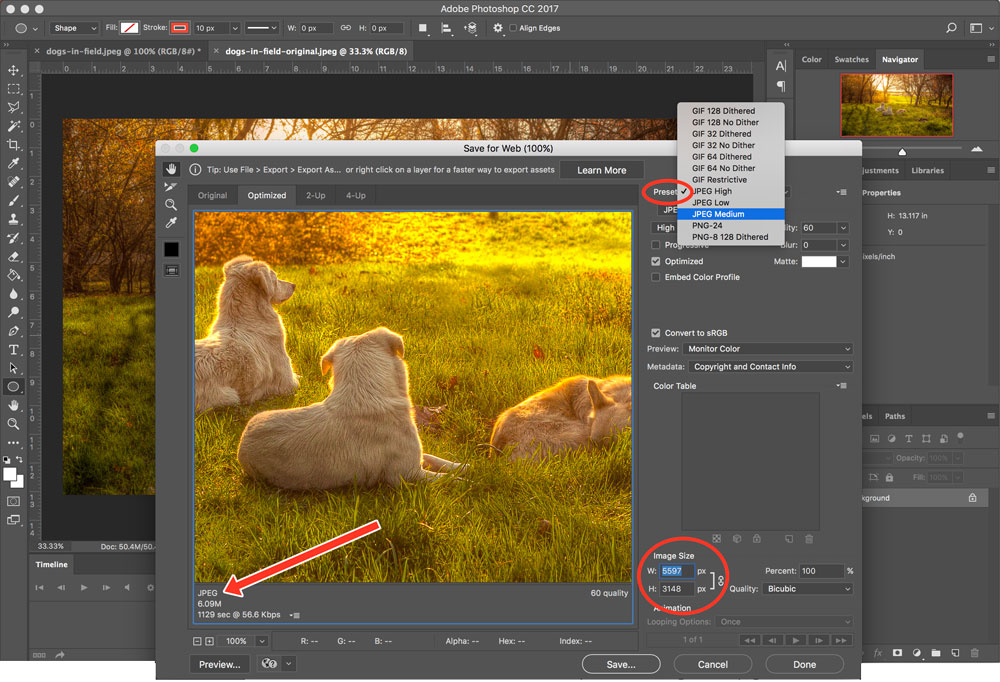

The process of **optimizing** files compresses or rewrites them to be as efficient as possible for their desired platform. For the web, this means optimizing media for **screens** and screen resolution, in order to keep file sizes as small and accessible as possible.

_On your own, it is easiest to optimize images._ This can be done cheaply and quickly, and doing so will drastically improve the efficiency of your site. For video and audio, it is generally recommended to use a service to do the heavy-lifting for you.

## Images
If you recall from the last <a href="../../topic-06/img-save/" target="_new">topic</a>, images should be **less-than 1,000 KB** in size (under 1 megabyte), screens only need _72 ppi_ for proper resolution, and the larger your files, the longer it will take your page to load. 

Don't forget to optimize images for the web by using image editors' "Save for Web and Devices" or "Export As" in their save options. 

Again, here is the <a href="https://images.pexels.com/photos/241828/pexels-photo-241828.jpeg" target="_blank">original dog image</a>, which clocks in at an _enormous_ 23.9 mB, and 5597px by 3148px. Watch how long that loads in another tab.

In contrast the one you see below was optimized for web, sized and cropped to 1000px by 500px. It's much more manageable at 110 kB, and is hardly distinguishable from the original (at least on the web).

## Video
_It is recommend you use a service to host videos. We will not discuss optimization in-depth here._

A 10-minute YouTube video is often near **100 MB** in size. Full-length movies can reach up-to **25GB** - this is beyond the capacity of most web hosting companies.

If these files from other sources, you likely will not have access to the original file, and therefore will not be able to correctly re-format or compress it. If you do, however, Certain plugins can be downloaded for video editors like Adobe Premiere so that you can export .webm and other filetypes without a band-aid online conversion, through sites like <a href="https://cloudconvert.com/" target="_new">CloudConvert</a>

## Audio
_It is recommend you use a service to host audio. We will not discuss optimization in-depth here._

A single MP3 song is **approximately 3-4 MB**.

While this is not particularly large, you will need multiple versions of the song for the site, as well as a higher-quality format. This can add up quickly, and it can be a process to accomplish.

For example, with audio, to export an .ogg file (whether it's a song you own or have recently sourced), you may need to use an online converter like <a href="https://convertio.co/mp3-ogg/" target="_new">Convertio</a> or <a href="http://www.zamzar.com/convert/mp3-to-ogg/" target="_new">Zamzar</a>. Again, this is only a band-aide; ideally, you're providing your own created audio (music, recordings, sound effects, etc) which you can export as an .ogg legally.
