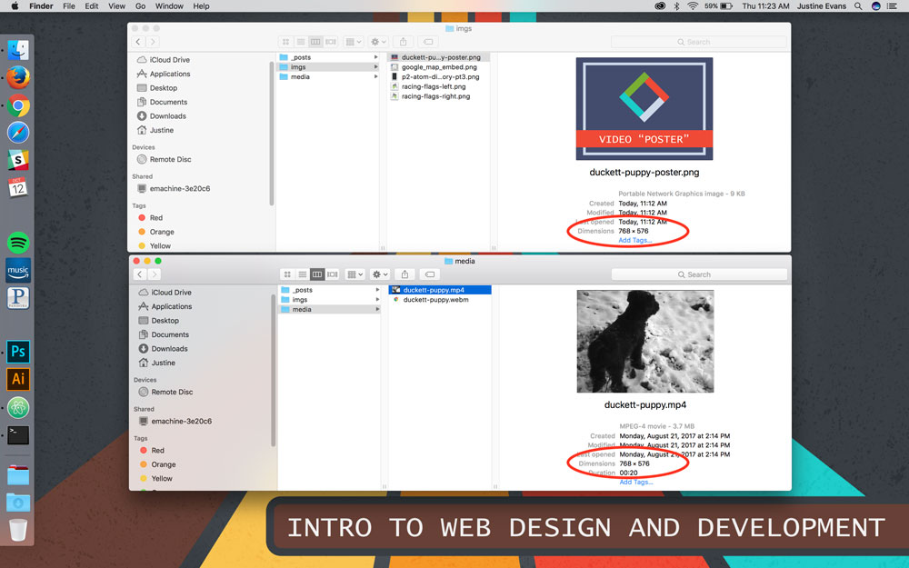

The **poster attribute** (`poster="#"`) should always be supplied with the `<video>` element. This attribute takes a URL as its value, which should point to an image that is displayed in place of the video until the visitor elects play the video.

## Single-Source

  

    

      60% Complete (success)
    

  

  

    
<video src="#" poster="#" width="..." height="..." preload controls ></video>

  

## Multiple-Source

  

    

      60% Complete (success)
    

  

  

    
<video  poster="#" width="..." height="..." preload controls>
         
        &lt;source src="#" type=""&gt;
         
        &lt;source src="#" type=""&gt;
         
    </video>

  

Note The image should be the same width/height ratio as the video element.

