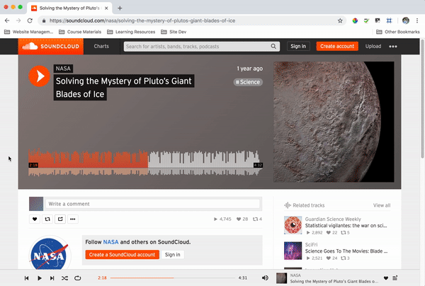

Like with video, there are two ways to approach adding audio to your site: self-hosted (within your own directory and repository), or via an audio-sharing service, like <a href="https://soundcloud.com/" target="_new">SoundCloud</a> or <a href="https://bandcamp.com/" target="_new">BandCamp</a>.

## Self-Hosted Audio

The `<audio>` element allows developers to add an audio player to webpages. This is a new element to HTML5, and offers three supported audio formats: .mp3, .wav, and .ogg.

The **audio element** can be used to add a self-hosted audio file to your site, and allows for both single-instances and fallback files to be referenced in the element.

## Service-Hosted Audio

To embed an audio sample from an audio-sharing service, use their provided embed code, which often utilizes the `<iframe>` element.

The following is an example for <a href="https://soundcloud.com" target="_new">SoundCloud</a>:

Note Some services will limit the number of 'plays' that you can have for a certain period of time on the “free-tiers.”
