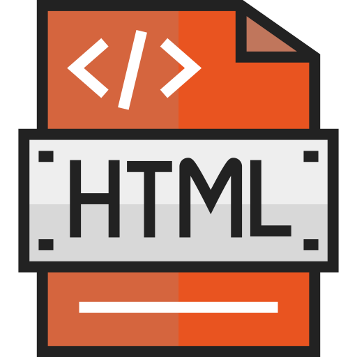

  
  <h2 style="text-align: center;">HTML and Styles</h2>

HTML is the backbone of web languages. We've spent several weeks learning about this as structural dialogue, and now we will put everything we've learned so far into practice.

This week, using our knowledge of HTML and GitHub, we will create a 3-page “Instructable” (illustrated instruction guide). If you've never utilized an Instructable, explore <a href="https://www.instructables.com/" target="_blank">the Instructables website</a> for ideas on both content and layout!

Think of a topic you know a lot about - an academic study, craft, favorite recipe, artist technique, etc. for example - and begin collecting materials. The site you build should contain:
1. Structural and semantic markup.
2. Well-organized block-style page structure.
2. Images (preferably your own, but sourced is allowed).
4. Embedded media (video, audio, and Google map).
5. Clean, legible coding.

Objectives of this topic are as follows.
<ul class="pros-and-cons">
  <li class="icon-pro">Create a self-made 3+ page site.</li>
  <li class="icon-pro">Showcase an understanding of HTML as markup language.</li>
  <li class="icon-pro">Present a cohesive, linear, and complete set of instructions, directions, or other how-to guide through basic structure and basic styling.</li>
  <li class="icon-pro">Gain introductory knowledge of inline and embedded styles</li>
</ul>
