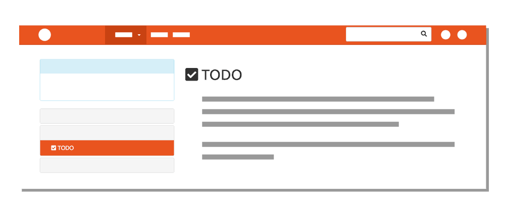

All sites utilize styling, whether its provided by the browser, or created by the designer. In this site, for example, pages contain different styling “commands” like:
- How to display links in a list.
- Change the background color of active links.
- Float icons to the left of text.
- Split window so page navigation is one-third (33%) of the width.
- What color to make all of the text.

Keep in mind that there are three ways to apply styles.

1. **Inline styling** - apply a style directly to a element by adding the style attribute to that element.  This affects only that element.
2. **Embedding styling** - apply a style in the `<style>` element in the head of the page.  This affects the entire page.
3. **External stylesheet** - link to a page containing styles which can affect multiple pages as long as each page links to that the external style sheet.

**Important**
So far, embedded styles is the only technique we have used.  We will introduce inline styles this week and look at external stylesheets in the coming weeks.  This week's conversation on style is not meant to be comprehensive, but a primer to what is to come.  We will get more details starting next week!

For the most part, this is the same across all pages, but not always. We can control _page styling_ by selecting elements and applying styling properties (like color and placement) to them.

This week, we will focus on applying a style to all elements or to a specific eleement using the style attribute.

For example:

1. By the structural element itself:
    - `body {}` (“Do ___ to the entire body of the page.”)
    - `p {}` (“Do ___ to all paragraphs on the page.”)
2. By using the style attribute:
    - `<body style=''>` ("apply a style to just the body element")
    