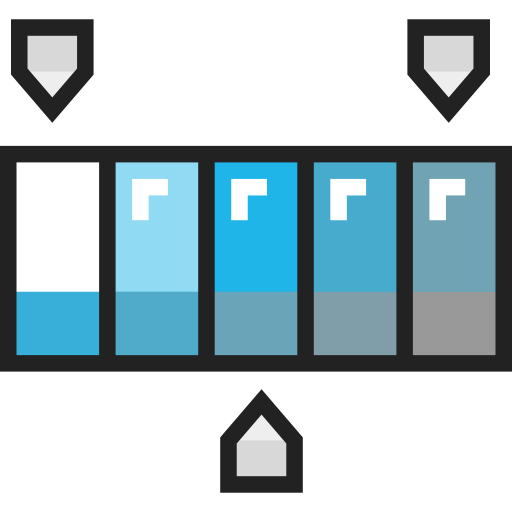

  
  <h2 style="text-align: center;">CSS Fundamentals</h2>

While we've explored styling briefly in the previous topics, it's time to really dig into learning how to use CSS or Cascading Style Sheets.

CSS is a language that tells browsers how to display and style content in HTML. It does not change the content itself, but will allow you to specify color, font, size, background, padding, alignment, how pages resize, if certain elements should be hidden, and many more qualities.

The objectives of this topic is:
<ul class="pros-and-cons">
  <li class="icon-pro">Understanding how CSS functions in web design, and the many ways one can use it in their pages.</li>
  <li class="icon-pro">Experimenting with CSS selectors and declarations, and linking stylesheets to HTML pages.</li>
</ul>
