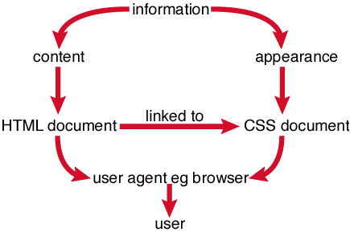

  

  
It is perfectly acceptable to place CSS within the HTML document if the CSS is minimal, like we did in Project 2. Usually, however, you should place CSS in one or more external "style sheets.".

  
The next section is dedicated to this method.

