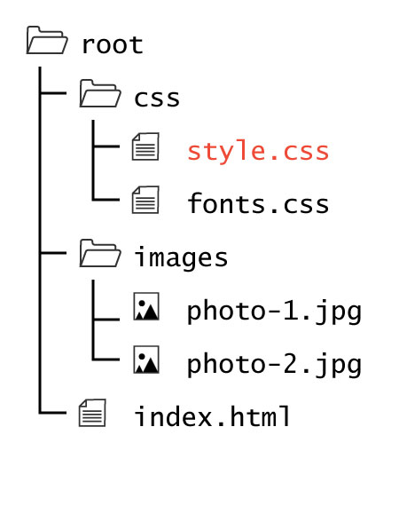

  

  
CSS documents are separate files dedicated solely to styling.

  
Unlike HTML documents which can include bits of styling or scripts if they are minimal enough, CSS documents contain only styling rules. They do not require structural elements like HTML documents, but can contain just as many lines of code, if not significantly more.

  
A CSS document is given the <code>.css</code> extension. As with images and media, it is considered best practice to place your CSS documents in a separate child directory labeled either "css" or "style."

