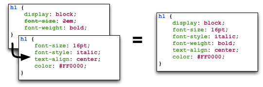

In CSS, it is possible and common to have two or more selectors that cause declarations to apply to the same element. CSS implements specific rules and algorithms to determine which rules ultimately apply to the specific element.

This is known as **cascading**, and is fundamental to the idea of CSS (hence why it is part of the name for the language).
