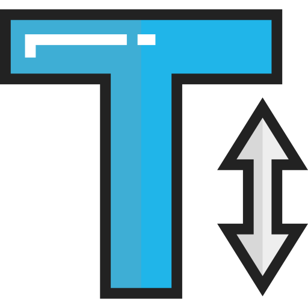

  
  <h2 style="text-align: center;">CSS Fonts, Decorating and Alignment</h2>

Moving on with CSS, this week will cover text and fonts. Despite being a very graphic art, the success of a good web design is usually heavily dependent on how it treats its use of written elements. To study this, we will look at:

- Typography
- Choosing Fonts
- Normal, Hover, and Active States

Grasping these concepts will make your text visually interesting without sacrificing structure and legibility.

By the end of this Topic, we hope you:
<ul class="pros-and-cons">
  <li class="icon-pro">Know how to source fonts from the web.</li>
  <li class="icon-pro">Understand the difference and usage of system, web, and web-safe fonts.</li>
  <li class="icon-pro">Have considered appropriate text styling, balancing “fun” and “functionality” in your site design.</li>
</ul>
