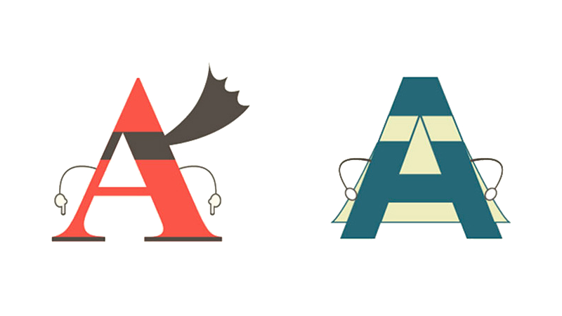
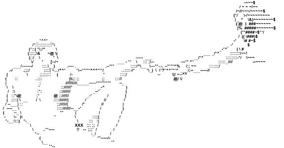

  

    

      

        <a href="../img/serif-vs-sans-infographic.jpg" target="_blank" class="list-group-item">
          
          <h4 class="list-group-item-heading">“Serif vs. Sans” The Final Battle</h4>
          

          
<i class="fa fa-clock-o" aria-hidden="true"></i> 6 minute reading

        </a>
      

    

  

  

    

      

        <a href="http://fontpair.co/" target="_blank" class="list-group-item">
          
          <h4 class="list-group-item-heading">Explore Popular Font Pairings</h4>
          

          
<i class="fa fa-clock-o" aria-hidden="true"></i> 4 minute activity

        </a>
      

    

  

  

    

      

        <a href="http://patorjk.com/software/taag/#p=display&f=Epic&t=Intro%0AWeb%20Dev%20%0A%26%20Design" target="_blank" class="list-group-item">
          
          <h4 class="list-group-item-heading">Make Some ASCII Art</h4>
          

          
<i class="fa fa-clock-o" aria-hidden="true"></i> 2 minute activity

        </a>
      

    

  

