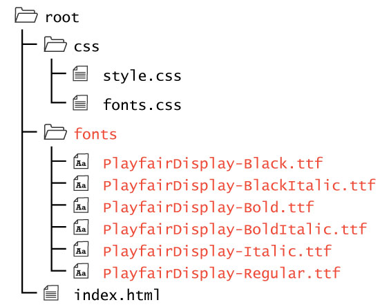

As with anything included in your site, the files must be organized in a set directory structure.

Font files should be placed in a child-directory, labeled something along the lines of <code>/fonts</code>.

To use these fonts we would include an <code>@font-face</code> for <i>each</i> font (as we did in the previous pages), along with relative URLs for each font type. This allows us to ensure compatibility with all browsers.

