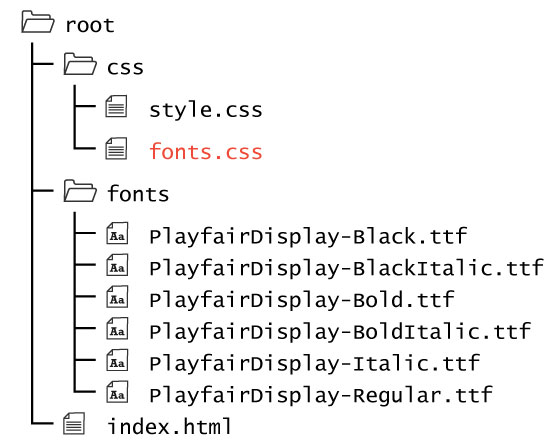

<div class="divider-heading"></div>

Many developers will move the font import statements into their own CSS file, `fonts.css`. These allows the main CSS file to be cleaner in appearance.

<div style="display: inline-block; width: 100%;">
<p>If you plan on doing a lot with fonts, you should have a separate <code>fonts.css</code> in your <code>/css</code> directory, to separate site styling from font styling.</p>
</div>

<span class="label label-danger">IMPORTANT:</span> The `fonts.css` file should be linked **before** the `style.css` file in `<head>` of any HTML page. This is important in allowing the latter file to 'see' the fonts.

<div class="code-heading">
  <span class="css">CSS</span>
</div>
```css
<head>
  <title>...</title>
  <link rel="stylesheet" type="text/css" href="./css/fonts.css">
  <link rel="stylesheet" type="text/css" href="./css/style.css">
</head>
```
