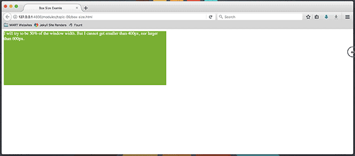

There are a few ways of ensuring our boxes are sized appropriately for the contained content. One is to set **min and max sizes** for both width and height.

Setting the `min-width: ` and/or `min-height: ` properties ensures a content box will never be too small.

Likewise, setting the `max-width: ` and/or `max-height: ` properties ensures that a box that is intended to display a small amount of information never gets too big.

  

### Testing
When thinking about adaptive sizing, you should always test by - you guessed it - resizing your browser to see how your layout performs. Start by manipulating your window:

Your layout may also be affected by text size. If you think the size of your text is totally in your control, you are 100% wrong. Most browsers allow for user zooming as an accessibility feature. Try zooming in to see how this affects the contents:

  - For Mac:
    <kbd class="keyboard-key nowrap" style="border: 3px outset #F3F3F3; border-left-color: #DBDBDB; border-top-color: #DBDBDB; background-color: #F3F3F3; padding: 0px 2px; font-family: inherit; font-size: 0.85em; color: black">
    ⌘ Cmd</kbd>
    and
    <kbd class="keyboard-key nowrap" style="border: 3px outset #F3F3F3; border-left-color: #DBDBDB; border-top-color: #DBDBDB; background-color: #F3F3F3; padding: 0px 2px; font-family: inherit; font-size: 0.85em; color: black">+</kbd>
    or
    <kbd class="keyboard-key nowrap" style="border: 3px outset #F3F3F3; border-left-color: #DBDBDB; border-top-color: #DBDBDB; background-color: #F3F3F3; padding: 0px 2px; font-family: inherit; font-size: 0.85em; color: black">-</kbd>

  - For PC:
    <kbd class="keyboard-key nowrap" style="border: 3px outset #F3F3F3; border-left-color: #DBDBDB; border-top-color: #DBDBDB; background-color: #F3F3F3; padding: 0px 2px; font-family: inherit; font-size: 0.85em; color: black">Ctrl</kbd>
    and
    <kbd class="keyboard-key nowrap" style="border: 3px outset #F3F3F3; border-left-color: #DBDBDB; border-top-color: #DBDBDB; background-color: #F3F3F3; padding: 0px 2px; font-family: inherit; font-size: 0.85em; color: black">+</kbd>
    or
    <kbd class="keyboard-key nowrap" style="border: 3px outset #F3F3F3; border-left-color: #DBDBDB; border-top-color: #DBDBDB; background-color: #F3F3F3; padding: 0px 2px; font-family: inherit; font-size: 0.85em; color: black">-</kbd>
