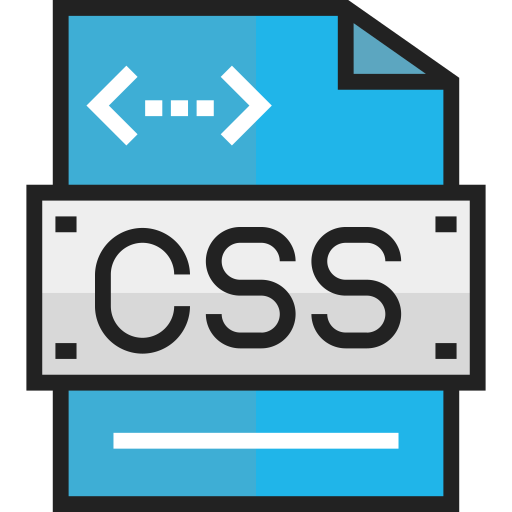

  
  <h2 style="text-align: center;">CSS Website</h2>

Now that you've had some practice with using CSS, let's apply it to building sites filled with pages that look and fuction with a cohesive theme.

For this site, use your knowledge of CSS to create a standard 4-page site for an imaginary client. You'll be introduced to placeholder content and using filler content while prototyping, as well as standard navigation and placement. This site should showcase:
1. Your understanding of color.
2. Well-selected and well-paired fonts.
2. Creative use of typography principles.
4. Use of positioning text, media, and layout elements.
5. Clean, legible coding.

By the end of this Topic, we hope you:
<ul class="pros-and-cons">
  <li class="icon-pro">Have a self-made 4+ page site.</li>
  <li class="icon-pro">Showcase an understanding of CSS as a styling language.</li>
  <li class="icon-pro">Explored building a site based off of a theme, which is reflected across all its content.</li>
</ul>
