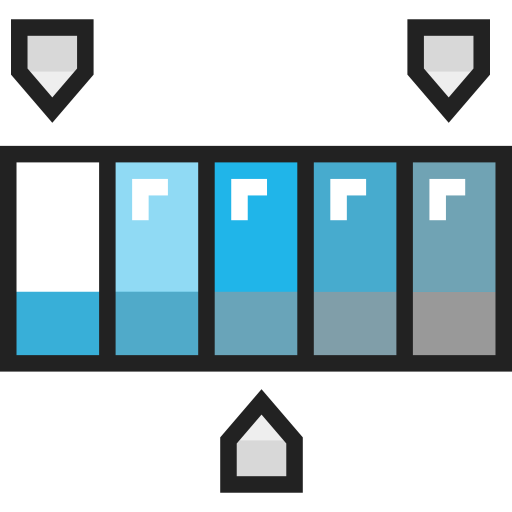

Below is a list of previous sections of the site you should be quite familiar with by now. Feel free to review these portions before and during the making of your site.

<h3>Review from CSS Fundamentals</h3>

  

    

      

        <a href="../../topic-09/css-docs/" target="_blank" class="list-group-item">
          
          <h4 class="list-group-item-heading">Review: Using CSS Documents</h4>
          

          
<i class="far fa-clock" aria-hidden="true"></i> 2 minute activity

        </a>
      

    

  

  

    

      

        <a href="../../topic-09/selectors-universal/" target="_blank" class="list-group-item">
          
          <h4 class="list-group-item-heading">Review: CSS Selector Types</h4>
          

          
<i class="far fa-clock" aria-hidden="true"></i> 2 minute activity

        </a>
      

    

  

  

    

      

        <a href="../../topic-09/bg-color/" target="_blank" class="list-group-item">
          
          <h4 class="list-group-item-heading">Review: Using Color</h4>
          

          
<i class="far fa-clock" aria-hidden="true"></i> 2 minute activity

        </a>
      

    

  

<h3>Review from CSS Fonts, Decorating and Alignment</h3>

  

    

      

        <a href="../../topic-10/font-typefaces/" target="_blank" class="list-group-item">
          
          <h4 class="list-group-item-heading">Review: Typeface Examples</h4>
          

          
<i class="far fa-clock" aria-hidden="true"></i> 2 minute activity

        </a>
      

    

  

  

    

      

        <a href="../../topic-10/font-family/" target="_blank" class="list-group-item">
          
          <h4 class="list-group-item-heading">Review: Using Fonts</h4>
          

          
<i class="far fa-clock" aria-hidden="true"></i> 2 minute activity

        </a>
      

    

  

  

    

      

        <a href="../../topic-10/pseudo-selectors/" target="_blank" class="list-group-item">
          
          <h4 class="list-group-item-heading">Review: Pseudos</h4>
          

          
<i class="far fa-clock" aria-hidden="true"></i> 2 minute activity

        </a>
      

    

  

  

    

      

        <a href="../../topic-10/google-fonts-part-1/" target="_blank" class="list-group-item">
          
          <h4 class="list-group-item-heading">Review: Using Google Fonts</h4>
          

          
<i class="far fa-clock" aria-hidden="true"></i> 2 minute activity

        </a>
      

    

  

<h3>Review from CSS Positioning</h3>

  

    

      

        <a href="../../topic-11/box-model/" target="_blank" class="list-group-item">
          
          <h4 class="list-group-item-heading">Review: The Box Model</h4>
          

          
<i class="far fa-clock" aria-hidden="true"></i> 2 minute activity

        </a>
      

    

  

  

    

      

        <a href="../../topic-11/float-intro/" target="_blank" class="list-group-item">
          
          <h4 class="list-group-item-heading">Review: Float</h4>
          

          
<i class="far fa-clock" aria-hidden="true"></i> 2 minute activity

        </a>
      

    

  

