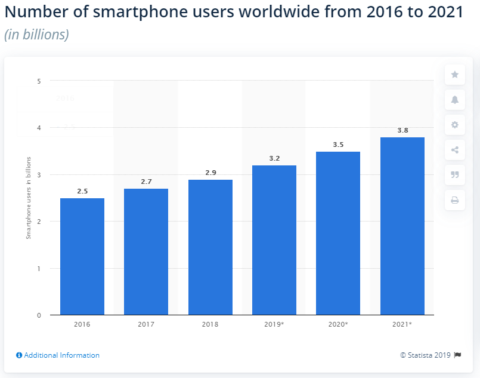

Two billion people—51% of the global population—access the internet only from their smartphones. By 2025, that number is expected to jump to 72.5%. So if you’re not designing for mobile, you—and your users—are in trouble. That’s why mobile-first design is a great strategy to employ for all digital products—websites, apps, software, or whatever else.

Let’s go into:

1. Defining mobile-first design
2. Why is mobile-first design important?
3. The connection between mobile-first design and accessibility
4. Mobile-first design best practices, plus examples
5. What is mobile-first design?

**Mobile-first design** is a design philosophy that aims to create better experiences for users by starting the design process from the smallest of screens: mobile. Designing and prototyping your websites for mobile devices first helps you ensure that your users’ experience is seamless on any device.

For example, if a mobile-first designer sits down to prototype or sketch out a website layout, they wouldn’t start sketching a desktop layout. Instead, they’d sketch out how it’d look on mobile, then move onto bigger and bigger screens.

The mobile-first design concept first came into the limelight in 2010 when Eric Schmidt, then-CEO of Google, announced at a conference that the company would be focusing more on mobile users in their design practices.

He said:

“What’s really important right now is to get the mobile architecture right. Mobile will ultimately be the way you provision most of your services. The way I like to put it is, the answer should always be mobile-first. You should always put your best team and your best app on your mobile app.”

The reasoning behind this is simple: Mobile design is more limited. After all, you’re designing for a smaller screen and can only fit so many elements into it. That means you choose only what’s most important—what your users need the most—while ignoring everything else.

As you expand your design, you can provide them with other elements, but you know exactly what you need to bring to the forefront.

**Why is mobile-first design important?**

It’s a matter of numbers: There are projected to be more than 3.5 billion mobile users in 2020, according to Statista. That means the majority of people are using their phones to find the content they need. There’s a big need for mobile-friendly websites out there, and so it’s your job to supply it for your users.

And, hot tip if you’re keeping your eyes on traffic: Google’s algorithm favors mobile-friendly websites.

From Google:

“Getting good, relevant answers when you search shouldn’t depend on what device you’re using. You should get the best answer possible, whether you’re on a phone, desktop or tablet. […] We started using mobile-friendliness as a ranking signal on mobile searches. […] We’ll start rolling out an update to mobile search results that increases the effect of the ranking signal to help our users find even more pages that are relevant and mobile-friendly.”

That means by providing a good user experience on mobile, you increase your discoverability—not to mention potentially your conversion rates.

And if we’re talking about experience, mobile-first design offers a wealth of opportunities for accessibility. Let’s discuss.

**The connection between mobile-first design and accessibility**

Here are a few ways mobile-first design and accessible design overlap:

Small-screen friendly. Mobile-first design pushes you to make your digital products more readable on smaller screens—and therefore more accessible to people who might be hard of seeing. And when your designs help people with limited vision, they’ll also help everyone else. This is classic, “Rising tide raises all ships.”
Hierarchy of information. As we’ll go into later, mobile-first means content first. That means, putting your most important content assets (i.e. the ones your users want) as soon as possible on your page. This also makes your content accessible to anyone with cognitive disabilities.

**3 tips for good mobile-first design**

### Tip #1: Mobile-first = Content-first

When it comes to mobile-first design, you need to remember one thing: Content is key.

You need to give your users all the content they’re looking for—and only that. Anything else might clutter and distract from your users’ experience.

After all, designing for mobile devices comes with a big constraint in screen sizes. That means you need to take a look at all of your content and present it in a visual hierarchy depending on how important it is to your user.

Only then can you fit the most important elements.

### Tip #2: Make it easy to navigate

Condense your secondary elements into easy-to-reach navigational buttons. One tried-and-true method of doing this is by using a hamburger menu.

Hamburger menus are recognizable ways for your user to attain access to secondary elements. If you don’t have one on the page already, chances are your users know to go to the hamburger menu to find what they’re looking for.

This does come with a catch though: low engagement.

According to a study by the user design research firm Nielsen/Norman Group, hidden navigation buttons like hamburger menus decrease content discoverability by 21%.

Not only that, but it also increases the time it takes to use the navigation by an average of two seconds.

Unfortunately, offering all of your possible links at once is unfeasible. Luckily, there’s a way you can get the best of both worlds.

Joe Toscano, an experience design consultant, recommends using combo navigation.

Toscano writes,

“Combo navigation allows the user to see the options they need the most and makes the rest accessible in a hamburger menu or something similar. […] The site’s content is laid out so well that I don’t need nav buttons. I can scroll the page and get where I want very easily. 

### Tip #3: KISS (Keep it simple, stupid)

Good mobile design is simple.

You never want to burden your users with extraneous elements like ads, pop-ups, and other content they don’t want to see—but especially not on mobile. Limit your limited visual real estate to only including the things they’re on the page for.

**Keep the user in mind**

In the end, the most important thing to remember when approaching mobile-first design is that you’re doing it for your user—and only your user.

If it doesn’t add value to their experience, you can probably leave it on the cutting room floor.

<a href="https://www.invisionapp.com/inside-design/mobile-first-design/" target="_new" ><em>Reference</em></a>

