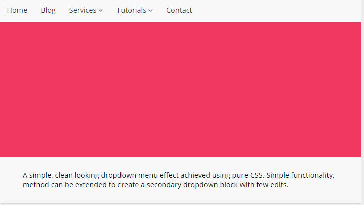

The primary navigation, or main site menu, contains all of your sites _major_ pages (or resources), and should be available to every page on that site at all times. This means that a visitor should be able to visit all important site pages independent of whatever page they're currently on.

So what makes up a good site menu?

For our purposes, the **nav bar** contains individual links to pages that deserve a spot in the main navigation. This is usually represented by a horizontal bar across the top of the site or a vertical list in a right sidebar, and often includes:
- The home page.
- An “about us” page.
- A contact page.
- A showcase page, such as services, portfolio, gallery, blog, or other collected works.

But often your site will have related materials that you alo want in the main navigation, but are too secondary to need their own parking spot in the nav bar. We can group these links inside a **dropdown menu**, hidden inside a broad term in the nav bar. Dropdowns usually require the user to hover their mouse over to make visible:

Source: <a href="https://codemyui.com/material-design-drop-down-navigation-menu/">Code My UI</a>

Lastly, most sites have a _constantly_ available menu regardless of where a visitor is currently scrolling. This site, for example, uses **fixed menu** - no matter how far you scroll down any page, you still see the main site navigation. This is down through setting the position of that element in your CSS.
