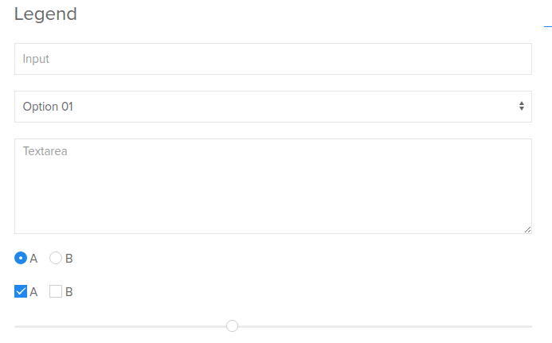

<div class="divider-heading"></div>


The thing that comes to mind when thinking of <a href="https://getuikit.com/" target="_new">UIkit</a> is minimalism. Minimalism not in features (in fact, it offers perhaps the most features of all frameworks), but in design. If super-clean, elegant, non-whitespace-shy designs are your thing, UIkit has you covered.  Here is a basic progress bar.


```html
<progress class="uk-progress" value="" max=""></progress>
```


Or the image marker component (a JS-driven interactive marker for images):


Or even the humble HTML form:



If this doesn't scream elegance at the top of its lungs, I don’t know what does. Just head over to the UIkit website and check out all the incredible components it has on offer. Unless your project manager or customer forces a particular style language on you, I think Uikit takes the crown for UI design and is several miles ahead of Google’s Material Design.

But is there a catch, you're wondering. Yes, there is. Like Bootstrap, UIkit works with its JavaScript and while you can use jQuery for DOM manipulation, using a virtual DOM framework like React is impossible.

Also, Uikit is a self-contained system, and you won’t be able to modify or extend it without putting in considerable effort.

<a href="https://geekflare.com/best-css-frameworks/" target="_new"><em>Reference</em></a>

<div class="divider-pg"></div>


